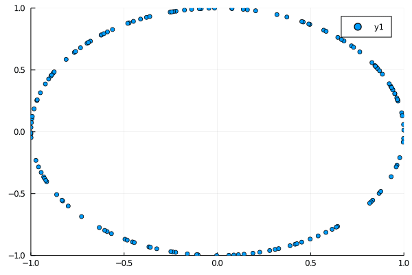

# Spontaneous Synchronization
When a system of oscillators are allowed to communicate where each individual
oscillator can feel the oscillations from the other oscillators in the system,
they will tend to spontaneously synchronize. Here is a gif showing what that
looks like.

